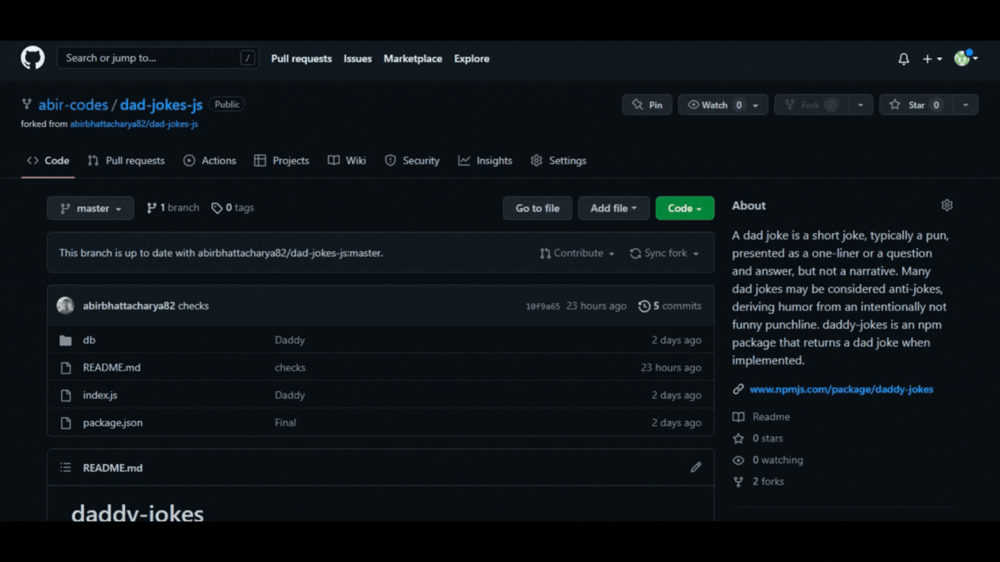

# daddy-jokes [](https://www.npmjs.com/package/daddy-jokes)  

A dad joke is a short joke, typically a pun, presented as a one-liner or a question and answer, but not a narrative. Generally inoffensive, dad jokes are stereotypically told with sincere humorous intent, or to intentionally provoke a negative reaction to their overly-simplistic humor.
<br>
Many dad jokes may be considered anti-jokes, deriving humor from an intentionally not funny punchline.
<br>
A common type of dad joke goes as follows: A child will say to the father, "I'm hungry," to which the father will reply, "Hi, Hungry, I'm Dad."
<br>
daddy-jokes is an npm package that returns a dad joke when implemented.

## Installation
Open your command prompt or terminal and type the following to install the package
```
npm i daddy-jokes
```

## Usage
```
var daddy_jokes=require('daddy-jokes');
console.log(daddy_jokes());
```

## How can you contribute?
To contribute to daddy-jokes you can add your own dad jokes and increase our huge collection of dad jokes. To do that follow the steps below:
1. Fork the repository

2. Go to [jokes.json](db/jokes.json)

3. Check the joke id of the last joke
4. put your own joke in the format
```
,
{
    "id": <id of the last joke + 1>,
    "joke": <your dad joke>
}
```
5. Commit your changes

6. Create a pull request

<br>

We are going to review the pull request and merge it if it is a good __dad__ joke.

## Guidelines
Make sure the joke is not __racist__, __sexist__ or __offensive__ in any way. We do not promote such things. We want to keep the jokes __family friendly__.
