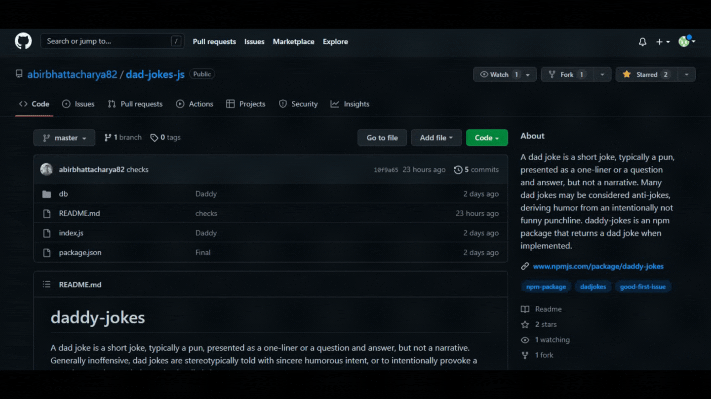
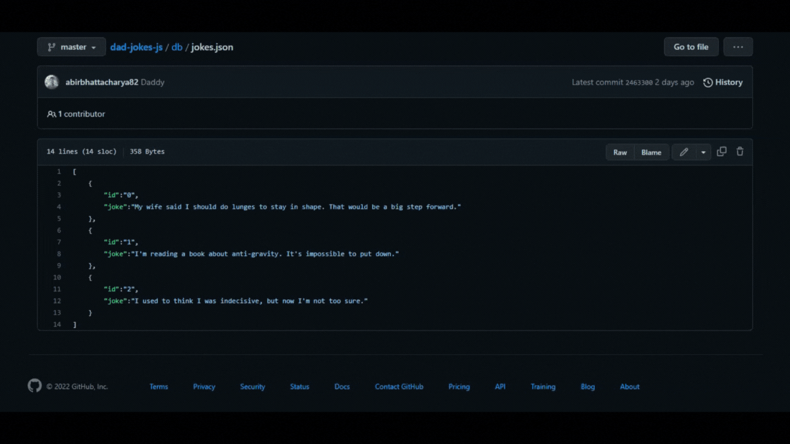
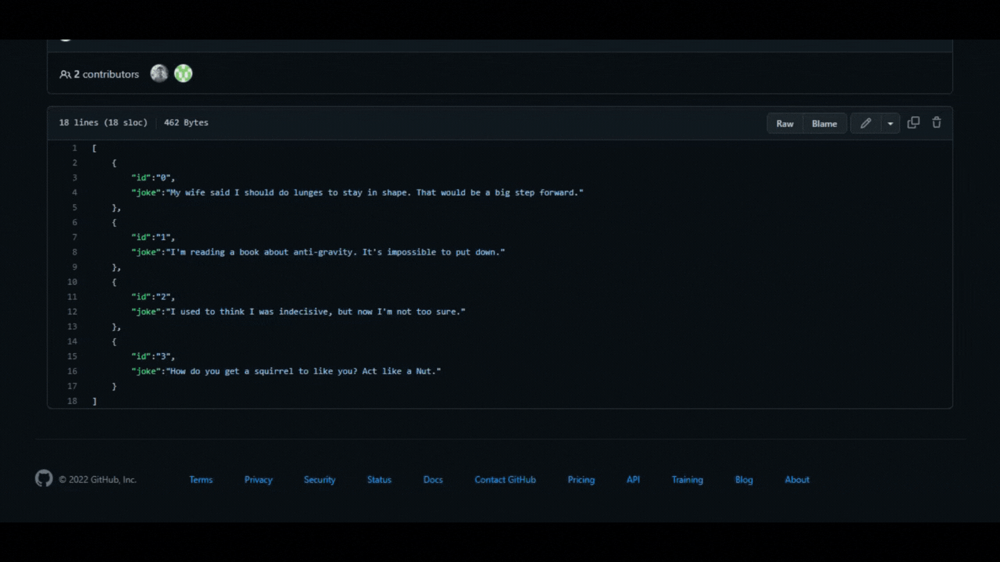

## How can you contribute?
To contribute to daddy-jokes you can add your own dad jokes and increase our huge collection of dad jokes. To do that follow the steps below:
1. Fork the repository

2. Go to [jokes.json](db/jokes.json)

3. Check the joke id of the last joke
4. put your own joke in the format
```
,
{
    "id": <id of the last joke + 1>,
    "joke": <your dad joke>
}
```
5. Commit your changes

6. Create a pull request

<br>

We are going to review the pull request and merge it if it is a good __dad__ joke.

## Guidelines
Make sure the joke is not __racist__, __sexist__ or __offensive__ in any way. We do not promote such things. We want to keep the jokes __family friendly__.